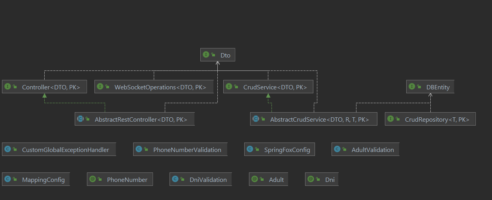

# basic core
proyecto base sobre el que se sustenta el trabajo fin de grado "sistema de recomendación inteligente para toma de decisiones", el cual dio lugar a la aplicación apptc moverse, fruto de la colaboración entre diferentes grados de la universidad pablo de olavide.

estructura básica del proyecto:


```
├── src
├── ├── java
├── ├── ├── es
├── ├── ├── ├── roiz
├── ├── ├── ├── ├── basiccore
├── ├── ├── ├── ├── ├──  application
├── ├── ├── ├── ├── ├── ├── rest
├── ├── ├── ├── ├── ├── ├── websocket
├── ├── ├── ├── ├── ├── ├── Controller.java
├── ├── ├── ├── ├── ├──  common
├── ├── ├── ├── ├── ├── ├── validation
├── ├── ├── ├── ├── ├── ├── ├── impl
├── ├── ├── ├── ├── ├── ├── ├── ├── AdultValidation.java
├── ├── ├── ├── ├── ├── ├── ├── ├── DniValidation.java
├── ├── ├── ├── ├── ├── ├── ├── ├── PhoneNumberValidation.java
├── ├── ├── ├── ├── ├── ├── ├── Adult.java
├── ├── ├── ├── ├── ├── ├── ├── Dni.java
├── ├── ├── ├── ├── ├── ├── ├── PhoneNumber.java
├── ├── ├── ├── ├── ├──  config
├── ├── ├── ├── ├── ├── ├── mapping
├── ├── ├── ├── ├── ├── ├── ├── MappingConfig.java
├── ├── ├── ├── ├── ├── ├── swagger
├── ├── ├── ├── ├── ├── ├── ├── SpringFoxConfig.java
├── ├── ├── ├── ├── ├──  domain
├── ├── ├── ├── ├── ├── ├── dto
├── ├── ├── ├── ├── ├── ├── ├── Dto.java
├── ├── ├── ├── ├── ├── ├── repository
├── ├── ├── ├── ├── ├── ├── ├── CrudRepository.java
├── ├── ├── ├── ├── ├── ├── service
├── ├── ├── ├── ├── ├── ├── ├── AbstractCrudService.java
├── ├── ├── ├── ├── ├── ├── ├── CrudService.java
├── ├── ├── ├── ├── ├──  exception
├── ├── ├── ├── ├── ├── ├── CustomGlobalExceptionHandler.java
├── ├── ├── ├── ├── ├──  infrastructure
├── ├── ├── ├── ├── ├── ├── DBEntity.java
├── .gitignore
├── .class_diagram.png
├── pom.xml
└── readme.md
```